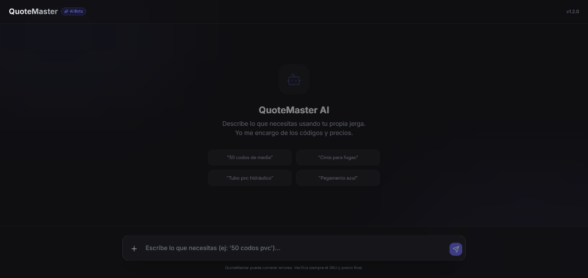

# QuoteMaster AI (Hardware Sales Agent)

Un agente de ventas inteligente diseñado para ferreterías, capaz de generar cotizaciones, identificar productos mediante lenguaje natural y gestionar inventario.



## 📋 Descripción

QuoteMaster AI ayuda a los empleados y clientes de ferreterías a encontrar productos y generar cotizaciones rápidamente. El sistema utiliza potentes modelos de lenguaje (vía Groq) para interpretar descripciones informales o jerga técnica (ej. "pegamento azul", "codos de media") y vincularlas con el inventario real.

## 🚀 Características Principales

*   **Búsqueda en Lenguaje Natural**: Encuentra productos describiéndolos con tus propias palabras.
*   **Gestión de Inventario**: Consultas en tiempo real sobre disponibilidad y precios.
*   **Generación de Cotizaciones**: Crea listas de productos con cálculos automáticos.
*   **Interfaz Moderna y Rápida**: Construida con React y Vite para una experiencia de usuario fluida.

## 🛠️ Tecnologías Utilizadas

Este proyecto utiliza una arquitectura moderna separada en frontend y backend:

### Frontend
*   **[React](https://react.dev/)**: Biblioteca principal de UI.
*   **[Vite](https://vitejs.dev/)**: Entorno de desarrollo ultrarrápido.
*   **[Tailwind CSS](https://tailwindcss.com/)**: Framework de utilidades para estilos.
*   **[Framer Motion](https://www.framer.com/motion/)**: Animaciones fluidas.
*   **Lucide React**: Iconos vectoriales elegantes.

### Backend
*   **[Node.js](https://nodejs.org/)** & **[Express](https://expressjs.com/)**: Servidor API robusto.
*   **[Groq SDK](https://wow.groq.com/)**: Inteligencia Artificial de alta velocidad para procesamiento de lenguaje.

## 📦 Instalación y Configuración

Sigue estos pasos para ejecutar el proyecto localmente.

### Prerrequisitos
*   Node.js (v16 o superior)
*   NPM (viene con Node.js)
*   Una API Key de [Groq](https://console.groq.com/)

### 1. Clonar el repositorio
```bash
git clone https://github.com/BR4Y4NEXE/hardware_sales_agent.git
cd hardware-sales-agent
```

### 2. Configurar el Backend
```bash
cd backend
npm install
```
Crea un archivo `.env` en la carpeta `backend` y agrega tu API Key:
```env
GROQ_API_KEY=tu_api_key_aqui
port=3000
```

### 3. Configurar el Frontend
En una nueva terminal:
```bash
cd frontend
npm install
```

## ▶️ Ejecución

Necesitarás correr ambos servidores simultáneamente (en dos terminales diferentes).

**Terminal 1 (Backend):**
```bash
cd backend
npm run dev
```

**Terminal 2 (Frontend):**
```bash
cd frontend
npm run dev
```
Abre tu navegador en la URL que muestra Vite (usualmente `http://localhost:5173`).

## 🧪 Pruebas/Tests

Este proyecto incluye pruebas unitarias tanto para el frontend como para el backend.

### Backend Tests
El backend utiliza **Jest** para testing unitario, cubriendo:
- **Servicio Groq**: Pruebas de procesamiento de chat, manejo de respuestas JSON, extracción de markdown, tool calls y manejo de errores.
- **Health Endpoint**: Validación del endpoint de salud del API.
- **Inventario**: Tests de búsqueda (exacta y fuzzy), filtros (categoría, material), y formato de respuestas.

**Comandos:**
```bash
cd backend
npm test                  # Ejecutar todos los tests
npm run test:watch        # Ejecutar en modo watch
npm run test:coverage     # Ver cobertura de código
```

### Frontend Tests
El frontend utiliza **Vitest** y **React Testing Library**:
- Pruebas de componentes React
- Tests de interacción de usuario
- Validación de renders

**Comandos:**
```bash
cd frontend
npm test                  # Ejecutar todos los tests
npm run test:coverage     # Ver cobertura de código
```

## 📸 Prototipo / Capturas

### Pantalla Principal
Interfaz limpia enfocada en la búsqueda natural.


*(Próximamente más capturas de demostración y pruebas)*

## 🤝 Contribución

Las contribuciones son bienvenidas. Por favor, abre un issue o envía un pull request para mejoras.
